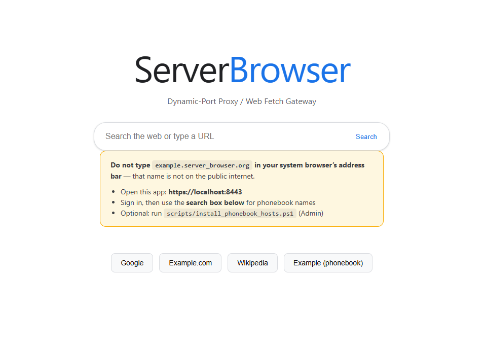

Copyright (C) 2026 Honkord 
# Server Browser (Top 3 Most Blindly-Dedicating-To-Wasting-My-Time Projects :P)

 

Server Browser is an indie local proxy server designed for remote
web browsing. The idea of this project is to create a private 
server that mimics like a typical browser to bypass websites 
through security programs, such as GoGuardian itself. Disappointedly, 
I inadvertently wasted my time on this project because GoGuardian
blocked the proxy server saddly after all. 
